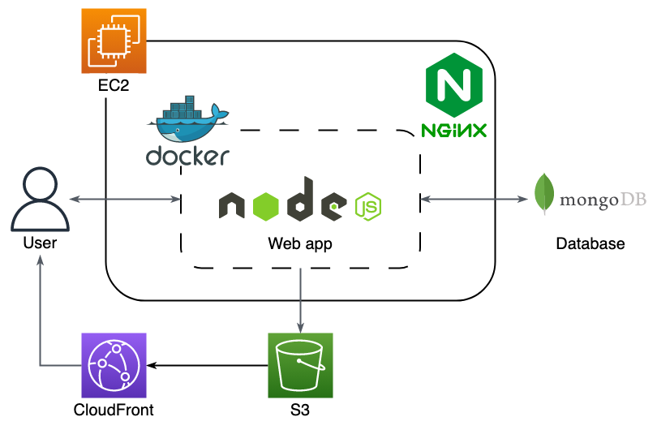
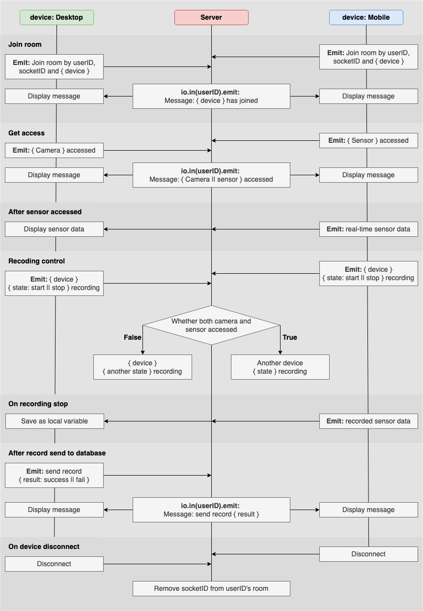
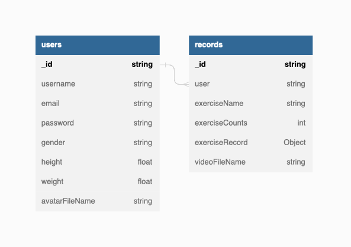
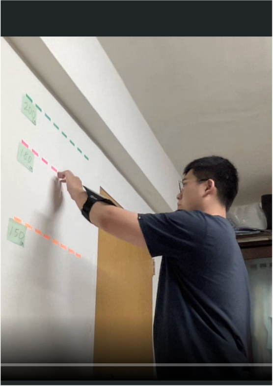
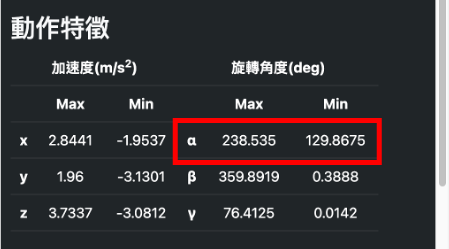
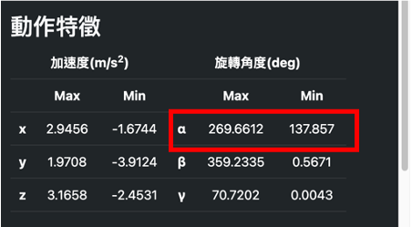
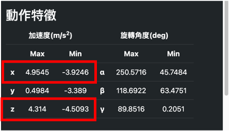
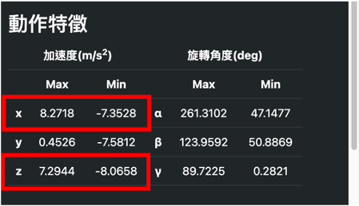

# 漸健康復 Get Well

漸健康復 Get Well is a platform for home-based rehabilitation exercises that allows users to record exercise videos and track acceleration and rotation angles. This helps users evaluate their recovery status and create a long-term tracking system for their practice.

🔗&nbsp;&nbsp;**Project link:** https://www.ting-yang14.com/
 
| Test Info | Value |
| ------------- | ------------- |
| email | testUser@gmail.com |
| password | testUser1! |

 

 

## Table Content

- [Main Feature](#main-feature)
- [Backend Technique](#backend-technique)
- [Frontend Technique](#frontend-technique)
- [Backend Architecture](#backend-architecture)
- [Socket Architecture](#socket-architecture)
- [Database Design](#database-design)
- [API Document](#api-document)
- [Real World Testing](#real-world-testing)
- [Contact](#contact)

## Main Feature

- Use **Socket.IO** to synchronize recording control between desktop and mobile
- Use **MediaStream Recording API** to record user motion video
- Use **DeviceMotionEvent API** to record mobile acceleration
- Use **DeviceOrientationEvent API** to record mobile orientation
- **MVC** Pattern
   

## Backend Technique

- Deployment
  - Docker
- Environment
  - Node.js / Express.js
- Database
  - MongoDB Atlas
- AWS Cloud Service
  - EC2
  - S3
  - CloudFront
- Network
  - HTTP & HTTPS
  - Domain Name System (DNS)
  - NGINX
  - SSL (ZeroSSL)
- Third Party Library
  - Socket.IO
  - Passport.js (JWT strategy)
  - joi.js
     

## Frontend Technique

- HTML / CSS / JavaScript
- Third Party Library
  - EJS template
  - Bootstrap 5
  - Axios
  - Chart.js
     

## Backend Architecture

 

## Socket Architecture

 

## Database Design

 

## API Document

🔗&nbsp;&nbsp;**Document link:** https://app.swaggerhub.com/apis-docs/ting-yang14/Get-Well/1.0.1

## Real World Testing

- Finger walk
  - the maximum value of &alpha; angle changes depending on the height user's finger climb on the wall
  <table>
      <tr>
          <td><b>150cm to 180cm</b></td>
          <td><b>150cm to 200cm</b></td>
      </tr>
      <tr>
          <td></td>
          <td> </td>
      </tr>
      <tr>
          <td></td>
          <td></td>
      </tr>
  </table>
   
- Pendulum stretch
  - the maximum and minimum value of the x and z axis of acceleration changes depending on the angle between user's arm and central axis during the pendulum stretch
  <table>
      <tr>
          <td><b>small angle</b></td>
          <td><b>large angle</b></td>
      </tr>
      <tr>
          <td></td>
          <td> </td>
      </tr>
      <tr>
          <td></td>
          <td></td>
      </tr>
  </table>

## Contact

👨‍💻 盧廷洋 Ting-Yang, Lu

📫 Email: tingyang.lu.14@gmail.com
