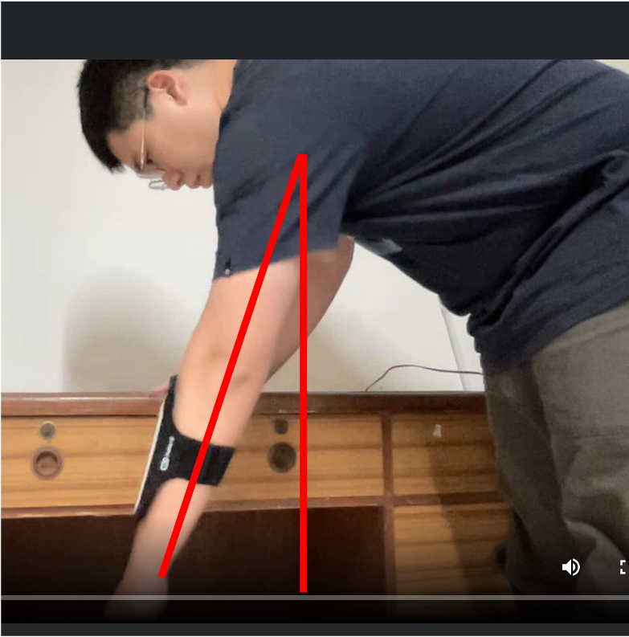

# 漸健康復 Get Well

漸健康復 Get Well is a platform for home-based rehabilitation exercises that allows users to record exercise videos and track acceleration and rotation angles. This helps users evaluate their recovery status and create a long-term tracking system for their practice.

🔗&nbsp;&nbsp;Project link: https://www.ting-yang14.com/
 
test account: testUser@gmail.com  
test password: testUser1!
 
 

 

## Main Feature

- Use Socket.IO to synchronize recording control between desktop and mobile
- Use MediaStream Recording API to record user motion video
- Use DeviceMotionEvent API to record mobile acceleration
- Use DeviceOrientationEvent API to record mobile orientation
- MVC Pattern
   

## Backend Technique

- Deployment
  - Docker
- Environment
  - Node.js / Express.js
- Database
  - MongoDB Atlas
- AWS Cloud Service
  - EC2
  - S3
  - CloudFront
- Network
  - HTTP & HTTPS
  - Domain Name System (DNS)
  - NGINX
  - SSL (ZeroSSL)
- Third Party Library
  - Socket.IO
  - Passport.js (JWT strategy)
  - joi.js
     

## Frontend Technique

- HTML / CSS / JS
- Third Party Library
  - EJS template
  - Bootstrap 5
  - Axios
  - Chart.js
     

## Backend Architecture

 

## Socket Architecture

 

## Database Design

 

## API Document

🔗&nbsp;&nbsp;Document link: https://app.swaggerhub.com/apis-docs/ting-yang14/Get-Well/1.0.1

## Real World Testing

- Finger walk
    <table>
        <tr>
            <td><b>150cm to 180cm</b></td>
            <td><b>150cm to 200cm</b></td>
        </tr>
        <tr>
            <td></td>
            <td> </td>
        </tr>
        <tr>
            <td></td>
            <td></td>
        </tr>
    </table>
     
- Pendulum stretch
    <table>
        <tr>
            <td><b>small rotation angle</b></td>
            <td><b>large rotation angle</b></td>
        </tr>
        <tr>
            <td></td>
            <td> </td>
        </tr>
        <tr>
            <td></td>
            <td></td>
        </tr>
    </table>

## Contact

👨‍💻 盧廷洋 Ting-Yang, Lu

📫 Email: sheep870104@gmail.com
